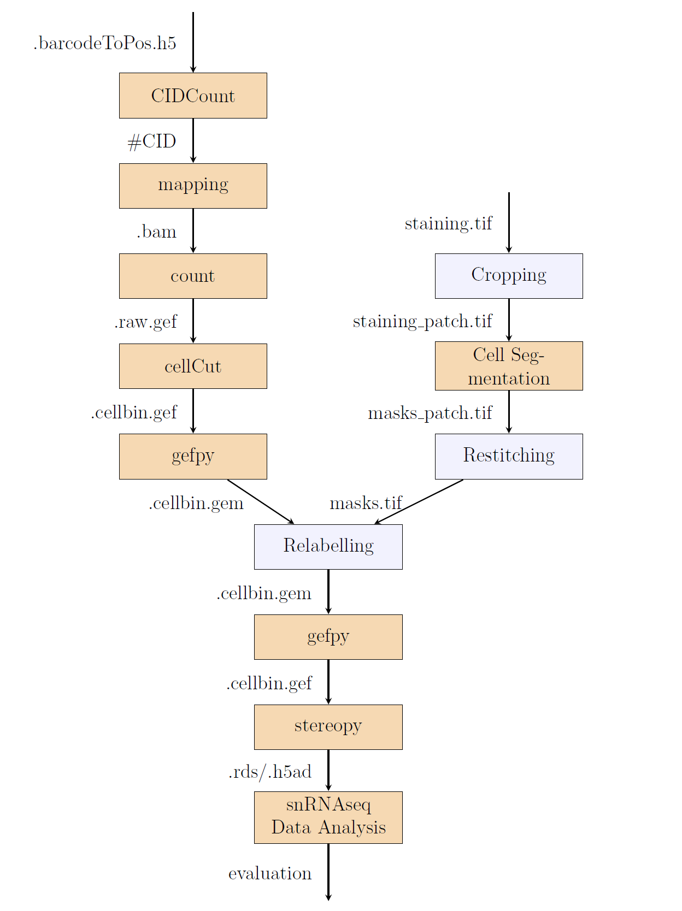

# CellSegBenchmark
This series of scripts is designed to incorporate different models for the cell segmentation module in [Stereo-seq Analysis Workflow (SAW)](https://github.com/STOmics/SAW).

00.crop.py crops the original staining image into patches of desired size and overlapping. 

01.stitch.py stitches the predicted patches back to one predicted image. 

02.relabel.py relabels each mask in the predicted image based on their connectivity and the value of their entries. 

03.editcgem.py makes use of the relabelled image to assign cell labels to transcripts detected at corresponding coordinates, modifying the original .bin1.gem file into .cellbin.gem. 

04.cgem2cgef.py translates the tangible .cellbin.gem file (essentially a .tsv file) back to the SAW-compatible .cellbin.gef file. It requires the package [gefpy](https://gefpy.readthedocs.io/en/main/).

05.psc.py takes .cellbin.gef as input, performs standard analysis on the induced pseudo-single-cell/nuclei data using scanpy, and saves the processed data into seurat/scanpy-compatible .h5ad files. It requires the package [Stereopy](https://stereopy.readthedocs.io/en/latest/). 

